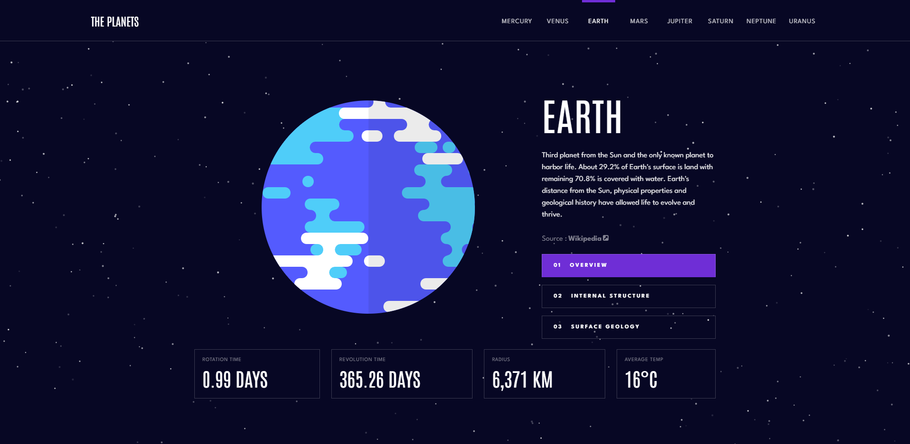
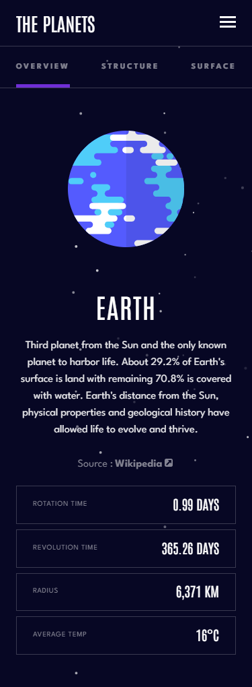
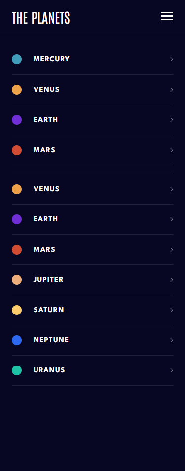

<h1 align='center'>The Planets</h1>

<h2 align="center">You can view the live site <a href="https://kieran-gill-planet-fact-site.vercel.app/">here.</a></h2>

## Overview

This project is a full-stack Single Page Application (SPA) that enables users to explore and learn about the planets in our Solar System. The front end of the application is built using TypeScript, React, React Router, Styled Components, Framer Motion, and particlesJs. The backend utilizes Superbase's Postgres database, offering a reliable and scalable data storage solution.

The site is fully responsive for desktops, tablets and mobile devices. It was built using a mobile-first approach.

During the development process, Miragejs was employed to simulate a server before integrating the actual backend. This allowed for efficient testing and development of the front-end components and interactions.

**NOTE:** Frontend Mentor.io provided the Figma design file for this project. All of the code implementations are my own original work.

## Table of contents

- [Overview](#overview)
- [Screenshot](#screenshots)
- [Link](#link)
- [My process](#my-process)
  - [Built with](#built-with)
  - [Development and Learning](#development-and-learning)
  - [Useful resources](#useful-resources)
- [Author](#author)

## Screenshots

<table>
  <tr>
    <td>
      
    </td>
  </tr>
</table>

<table>
  <tr>
    <td align="center">
      
    </td>
    <td align="center">
      
    </td>
    <td align="center">
      
    </td>
  </tr>
</table>

## Link

### You can view the live site [here](https://kieran-gill-planet-fact-site.vercel.app/)

## My Process

### built with

- TypeScript
- React
- React Router
- Styled Components
- Framer Motion
- Vite
- Particlesjs
- Superbase
- Cloudinary
- Miragejs

### Development and Learning

**September 2023 update**

- I converted the project to TypeScript. Converting this project to TypeScript was a fun learning experience! I enjoyed seeing the benefits firsthand like catching a couple of bugs I missed and getting helpful tooling in VSCode. There were some challenges too - diving into the type system took time and debugging type errors could be tricky. But overall it was really satisfying to incrementally add types file-by-file and see the codebase get stronger in the process. I'm looking forward to starting some fresh projects using TypeScript soon.

**Initial**

- My intention for this project was to challenge myself and make a multipage site, utilizing new tools alongside familiar ones.

- I used Styled Components for the first time and found it pretty easy to pick up and much cleaner than having a separate CSS file for each component. The Dynamic Styling features available were very handy and the scoping of styles helped to avoid a lot of headaches due to CSS clashing.

- React Router was an essential tool for this project and v6 is very user-friendly. I intend to use more of its features in my next project as I feel I was just scratching the surface of what I can do with it in this project.

- As the project progressed I felt it would be a good opportunity to incorporate a backend using a SaaS, instead of relying on local data. I chose Superbase as it has an excellent free tier and is very user-friendly and intuitive to use. Although creating a backend may not have been strictly necessary for a project involving only the eight planets in our solar system, it presented a valuable learning experience and a stepping stone for more complex projects in the future.

- I hosted the images using Cloudinary, which again has an easy enough to follow UI.

- Before building the back end, I used Miragejs to replicate a server enabling for more efficient frontend development and iteration

- Although beyond the scope of my original intentions, I decided to experiment with adding animations. After experimenting with using plain CSS for animations I opted for the Framer Motion library. The docs are fairly easy to navigate and I was able to implement this without many roadblocks as my animations are pretty simple. Simple Transitions on hover and click effects are still handled with plain CSS

- I also added a particle effect background using particlesjs. This was more difficult as I found the docs fairly confusing. I consulted with my frenemy ChatGPT and was able to breakdown and debug my code successfully.

- After completing the first iteration of my project, I wanted to refine the code and make it as DRY as possible. I used ChatGPT as a tool for this. Although some may view it as a controversial tool, I felt I learned a lot through this process. I fed it each component in turn and asked for a code review and acted upon the solutions that were useful; asking for further clarification in the process and thus learning more. Through its suggestions, I split some of the components down into smaller more efficient and reusable components. Additionally, I organized my environment variables and Superbase configurations into dedicated folders, such as "Config" and "Services.”

### Useful resources

- Stack Overflow
- Scrimbas [‘Browser Router V6’](https://scrimba.com/learn/reactrouter6) course
- part of Scrimba’s [‘Learn styled Components’](https://scrimba.com/learn/styledcomponents) Course
- Styled Components Docs
- React Router Docs
- Superbase Docs
- Cloudinary Docs

## Author

- [Kieran Gill - Portfolio](https://kieran-gill-portfolio.netlify.app/)
- [LinkedIn](www.linkedin.com/in/kieran-gill)
